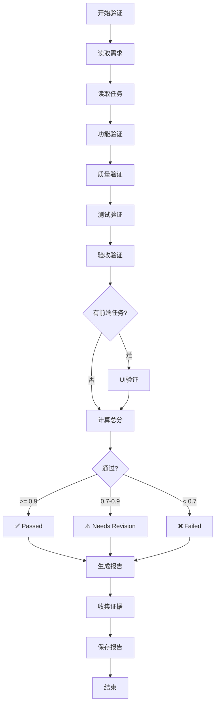

# IntentBridge 验收机制说明

## 📋 概述

IntentBridge 有**两套验收系统**，分别用于不同场景：

1. **AI 验证系统** (`ib ai validate`) - 轻量级 AI 验证
2. **闭环验证引擎** (`ib validate`) - 全功能闭环验证（v3.0.0 Phase 4）

---

## 🤖 1. AI 验证系统 (`ib ai validate`)

### 功能

使用 AI 分析需求完成度，快速验证实现情况。

### 使用方法

```bash
# 基础验证
ib ai validate REQ-001

# 带代码验证（检查实现代码）
ib ai validate REQ-001 --with-code

# 指定代码路径
ib ai validate REQ-001 --code-path src/auth/
```

### 验证内容

- ✅ 需求理解分析
- ✅ 验收标准检查
- ✅ 代码实现验证（可选）
- ✅ 完成度评分

### 适用场景

- 快速验证单个需求
- 不需要详细证据收集
- AI 辅助的轻量级验证

---

## 🔍 2. 闭环验证引擎 (`ib validate`) ⭐ 推荐

### 功能

**全功能 5 维度验证系统**，集成 MCP 工具进行实际验证，生成完整证据链。

### 命令

```bash
# 1. 验证需求实现
ib validate requirement <requirement-id>

# 2. 查看验证报告
ib validate report <requirement-id>

# 3. 列出所有验证报告
ib validate list

# 4. 查看证据详情
ib validate evidence <report-id>
```

### 5 维度验证

#### 📌 维度 1: 功能完整性 (Functional)

验证所有功能点是否实现：

- ✅ 检查需求描述中的功能点
- ✅ 验证相关任务完成状态
- ✅ 确认文件映射完整性
- ✅ 收集实现代码作为证据

**验证项示例**：
```
✅ 用户登录功能已实现
✅ JWT 认证逻辑已实现
✅ 会话管理已实现
```

#### 💎 维度 2: 代码质量 (Quality)

验证代码质量是否达标：

- ✅ 代码规范检查（ESLint/Prettier）
- ✅ 类型安全验证（TypeScript）
- ✅ 安全漏洞扫描
- ✅ 代码复杂度分析

**验证项示例**：
```
✅ 无 TypeScript 错误
✅ 无 ESLint 警告
✅ 无安全漏洞
✅ 代码复杂度 < 10
```

#### 🧪 维度 3: 测试覆盖 (Testing)

验证测试覆盖是否充分：

- ✅ 单元测试存在性检查
- ✅ 测试覆盖率验证（目标 >80%）
- ✅ 测试通过率验证（目标 100%）
- ✅ 关键路径测试验证

**验证项示例**：
```
✅ 单元测试文件存在: src/auth.test.ts
✅ 测试覆盖率: 85%
✅ 测试通过率: 100% (24/24)
```

#### ✅ 维度 4: 验收标准 (Acceptance)

AI 驱动的验收标准验证：

- ✅ 逐条检查验收标准
- ✅ 使用 AI 分析代码是否满足标准
- ✅ 提供详细通过/失败原因
- ✅ 生成改进建议

**验证项示例**：
```
✅ 用户可以使用邮箱和密码登录
✅ 会话在 24 小时后过期
⚠️ 密码重置功能未完全实现
```

#### 🎨 维度 5: UI/UX 验证 (UI/UX)

前端界面验证（仅前端任务）：

- ✅ Playwright 截图验证
- ✅ UI 元素存在性检查
- ✅ 响应式设计验证
- ✅ 可访问性检查

**验证项示例**：
```
✅ 登录表单渲染正确
✅ 按钮可点击
✅ 响应式布局正常
✅ 暗色模式支持
```

### 验证报告

每次验证生成完整报告，包含：

#### 报告结构

```yaml
id: VAL-1739640000000
requirementId: REQ-001
timestamp: "2026-02-15T22:00:00.000Z"
status: passed  # passed | needs_revision | failed
matchScore: 0.95  # 0-1，0.9 以上为通过
checklists:
  functional:
    score: 0.95
    passed: true
    items:
      - criterion: "用户登录功能"
        passed: true
        details: "已实现 JWT 认证"
        evidenceIds: ["EV-001"]
  quality:
    score: 0.92
    passed: true
    items: [...]
  testing:
    score: 0.88
    passed: true
    items: [...]
  acceptance:
    score: 0.95
    passed: true
    items: [...]
  ui:
    score: 0.90
    passed: true
    items: [...]
evidence:
  - id: EV-001
    type: code
    source: "src/auth/login.ts:45"
    content: "..."
    timestamp: "..."
summary: "需求实现度 95%，通过验收"
recommendations:
  - "建议增加密码重置功能的单元测试"
```

#### 报告存储

- **位置**: `.intentbridge/validation-reports.yml`
- **格式**: YAML
- **历史**: 保留所有历史报告

### 证据系统

每次验证收集完整证据链：

#### 证据类型

1. **代码证据** (`code`)
   - 实现代码片段
   - 文件路径和行号
   - 代码上下文

2. **测试证据** (`test_result`)
   - 测试执行结果
   - 覆盖率报告
   - 通过/失败详情

3. **截图证据** (`screenshot`)
   - UI 界面截图
   - Playwright 自动捕获
   - 存储在 `.intentbridge/evidence/`

4. **日志证据** (`log`)
   - 执行日志
   - 错误日志
   - 调试信息

5. **文档证据** (`documentation`)
   - API 文档
   - README 文件
   - 注释和说明

#### 证据存储

```
.intentbridge/
├── evidence/
│   ├── REQ-001/
│   │   ├── screenshot-001.png
│   │   ├── code-001.ts
│   │   └── test-result-001.json
│   └── REQ-002/
│       └── ...
└── validation-reports.yml
```

### 评分机制

#### 总体评分计算

```typescript
overallScore = (
  functionalScore * 0.30 +    // 功能 30%
  qualityScore * 0.20 +        // 质量 20%
  testScore * 0.25 +           // 测试 25%
  acceptanceScore * 0.15 +     // 验收 15%
  uiScore * 0.10               // UI 10%
)
```

#### 通过标准

- ✅ **Passed**: `overallScore >= 0.90` (90分)
- ⚠️ **Needs Revision**: `0.70 <= overallScore < 0.90` (70-90分)
- ❌ **Failed**: `overallScore < 0.70` (70分以下)

### MCP 工具集成

验证引擎使用 11 个 MCP 工具进行实际验证：

```typescript
// 1. 文件操作工具
executeMCPTool('read_file', { path: 'src/auth.ts' })
executeMCPTool('list_directory', { path: 'src/' })

// 2. 测试工具
executeMCPTool('run_tests', { testPath: 'tests/auth.test.ts' })
executeMCPTool('check_coverage', { path: 'src/auth/' })

// 3. 质量检查工具
executeMCPTool('lint_code', { path: 'src/' })
executeMCPTool('type_check', { path: 'src/' })

// 4. 安全扫描工具
executeMCPTool('security_scan', { path: 'src/' })

// 5. Playwright 工具
executeMCPTool('take_screenshot', { url: 'http://localhost:3000/login' })

// 6. Git 工具
executeMCPTool('git_status', {})
executeMCPTool('git_diff', { file: 'src/auth.ts' })

// 7. 执行工具
executeMCPTool('execute_command', { command: 'npm run build' })
```

### 完整验证流程



---

## 🎯 使用建议

### 场景 1: 开发阶段快速验证

```bash
# 使用 AI 快速验证
ib ai validate REQ-001 --with-code
```

**优点**: 快速、轻量
**缺点**: 无详细证据

### 场景 2: 正式验收交付 ⭐

```bash
# 使用闭环验证引擎
ib validate requirement REQ-001

# 查看详细报告
ib validate report REQ-001

# 查看证据
ib validate evidence VAL-1739640000000
```

**优点**: 完整证据链、5 维度验证、可追溯
**缺点**: 需要更多时间

### 场景 3: 批量验收

```bash
# 列出所有需求
ib req list

# 逐个验证
for req in REQ-001 REQ-002 REQ-003; do
  ib validate requirement $req
done

# 查看所有报告
ib validate list
```

---

## 📊 验收标准

### 功能验收 (30%)

- ✅ 所有功能点已实现
- ✅ 功能符合需求描述
- ✅ 无明显 Bug
- ✅ 代码已提交

### 质量验收 (20%)

- ✅ 无 TypeScript 错误
- ✅ 无 ESLint 警告
- ✅ 无安全漏洞
- ✅ 代码复杂度合理

### 测试验收 (25%)

- ✅ 测试覆盖率 ≥ 80%
- ✅ 测试通过率 = 100%
- ✅ 关键路径有测试
- ✅ 边界情况有覆盖

### 验收标准验收 (15%)

- ✅ 所有验收标准通过
- ✅ AI 验证通过
- ✅ 无遗留问题

### UI/UX 验收 (10%)

- ✅ 界面符合设计
- ✅ 响应式正常
- ✅ 暗色模式支持
- ✅ 可访问性达标

---

## 🔧 配置

### AI 配置

```bash
# 配置 AI 提供商（用于 AI 验证）
ib ai config
```

### MCP 工具配置

确保 MCP 工具可用（用于闭环验证）：
- 已在 `src/services/mcp-tools.ts` 中集成
- 自动检测和使用

---

## 📝 最佳实践

### 1. 验证时机

- ✅ 功能开发完成后立即验证
- ✅ 提交代码前验证
- ✅ 合并 PR 前验证
- ✅ 发布前全面验证

### 2. 验证频率

- 开发阶段: 使用 `ib ai validate` 快速验证
- 提交前: 使用 `ib validate requirement` 完整验证
- 发布前: 所有需求批量验证

### 3. 问题处理

```bash
# 验证未通过时
ib validate report REQ-001

# 查看具体问题
# 根据建议修复

# 重新验证
ib validate requirement REQ-001
```

### 4. 证据管理

- 定期清理旧证据（`.intentbridge/evidence/`）
- 保留验收报告（`.intentbridge/validation-reports.yml`）
- 重要证据提交到 Git

---

## 🆚 两套系统对比

| 特性 | AI 验证 | 闭环验证引擎 |
|------|---------|--------------|
| **速度** | ⚡ 快速 | 🐢 较慢 |
| **深度** | 📏 浅层 | 🔬 深度 |
| **证据** | ❌ 无 | ✅ 完整 |
| **维度** | 1 维 | 5 维 |
| **工具** | AI only | AI + MCP |
| **适用** | 开发阶段 | 正式验收 |
| **成本** | 低 | 中 |

---

## 🎓 总结

IntentBridge 提供了**灵活的两层验收机制**：

1. **快速验证** (`ib ai validate`): 开发过程中快速检查
2. **深度验收** (`ib validate`): 正式交付前的完整验证

**推荐流程**:
```
开发 → AI 快速验证 → 修复 → 闭环验证 → 通过 → 交付
```

**验收通过标准**: 5 维度综合评分 ≥ 90 分

---

**版本**: v3.2.1
**最后更新**: 2026-02-15
