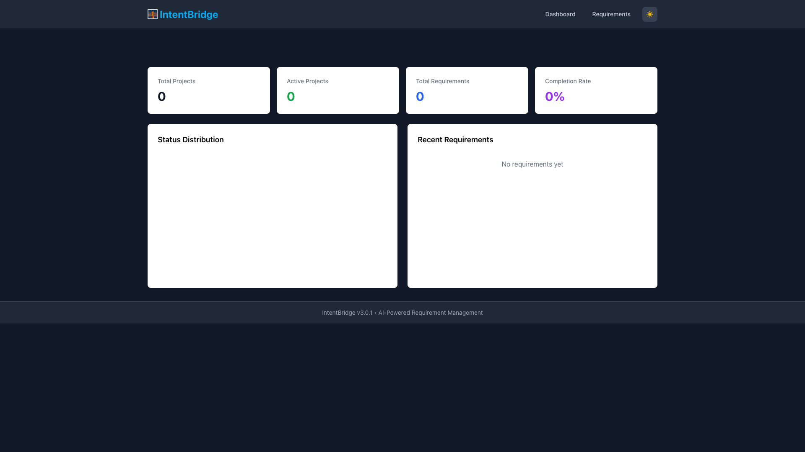
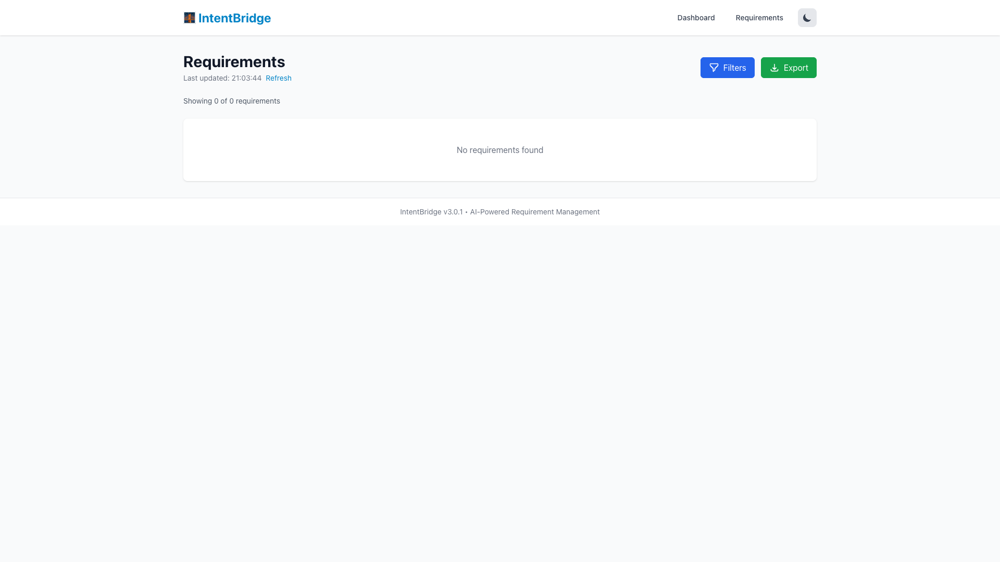
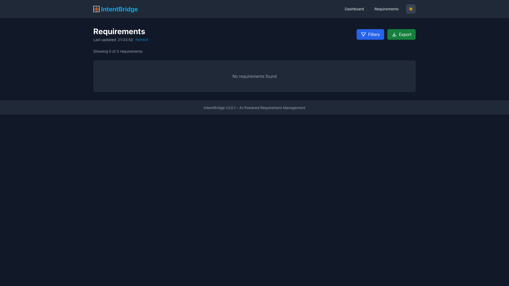
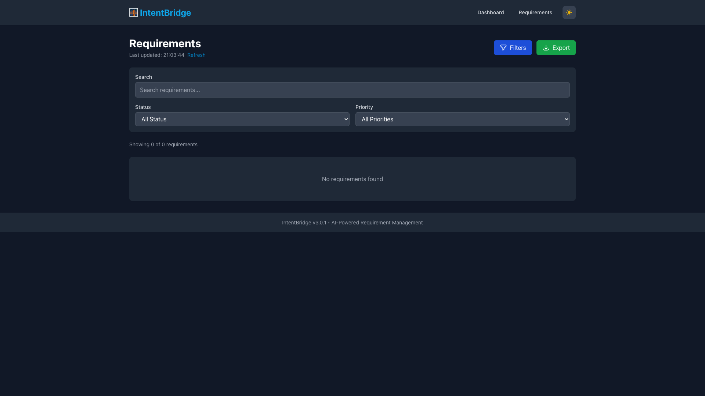
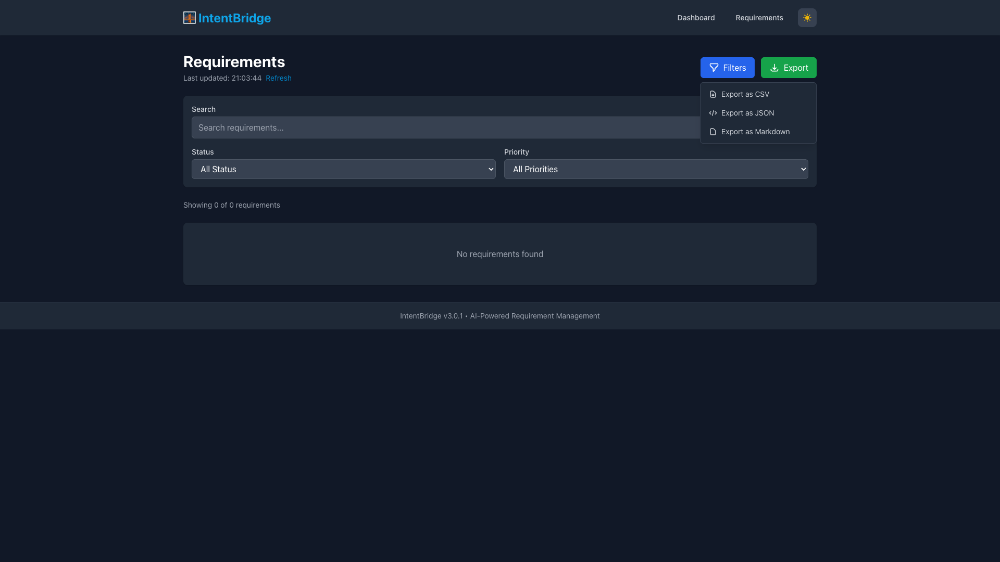

# IntentBridge Web UI 仪表板 v3.1.0

**中文文档** | **[English](README.md)**

一个精美的基于 Web 的仪表板，用于管理您的 IntentBridge 需求。

## 🎉 v3.1.0 新功能

### 1. 🌙 暗色模式
- **自动检测**：尊重系统偏好设置
- **手动切换**：一键主题切换
- **持久化**：记住您的选择（存储在 localStorage）
- **平滑过渡**：优美的颜色过渡效果

### 2. 🔄 实时更新
- **自动刷新**：每 10 秒更新一次数据
- **实时状态**：显示最后更新时间戳
- **手动刷新**：随时点击刷新
- **错误处理**：优雅的错误显示

### 3. 🔍 高级筛选
- **搜索**：全文搜索标题和描述
- **状态筛选**：按状态筛选（draft、active、implementing、done）
- **优先级筛选**：按优先级筛选（high、medium、low）
- **标签筛选**：多选标签过滤
- **清除全部**：一键重置所有筛选器

### 4. 📤 导出功能
- **CSV 导出**：导出为电子表格格式
- **JSON 导出**：导出供程序使用
- **Markdown 导出**：导出为格式化文档
- **时间戳文件名**：自动在文件名中添加日期

## 功能特性

- **仪表板概览**：一目了然地查看统计数据和状态分布
- **需求列表**：使用高级控件浏览和筛选需求
- **需求详情**：查看详细信息并更新状态
- **实时更新**：通过轮询立即反映更改
- **暗色模式**：日夜护眼
- **导出选项**：以多种格式下载数据

## 快速开始

### 1. 启动 Web 仪表板

从您的项目根目录（`.intentbridge/` 所在位置）运行：

```bash
ib web start
```

这将启动：
- **API 服务器**：http://localhost:9528
- **前端开发服务器**：http://localhost:3000

### 2. 在浏览器中打开

访问 http://localhost:3000 查看您的仪表板。

## 📸 界面截图与可视化指南

### 仪表板概览


*亮色模式下的仪表板*


*暗色模式下的仪表板*

仪表板提供项目状态的综合概览：

```
┌─────────────────────────────────────────────────────────────┐
│  仪表板                                        🌙/☀ 主题切换 │
├─────────────────────────────────────────────────────────────┤
│  ┌──────┐  ┌──────┐  ┌──────┐  ┌──────┐                  │
│  │项目  │  │活跃  │  │需求  │  │完成率│                  │
│  │总数  │  │项目  │  │总数  │  │      │                  │
│  └──────┘  └──────┘  └──────┘  └──────┘                  │
│                                                             │
│  ┌────────────────┐  ┌────────────────────┐              │
│  │ 状态分布       │  │ 最近的需求         │              │
│  │  [饼图]        │  │                    │              │
│  │                │  │  • REQ-001         │              │
│  │                │  │  • REQ-002         │              │
│  │                │  │  • REQ-003         │              │
│  └────────────────┘  └────────────────────┘              │
└─────────────────────────────────────────────────────────────┘
```

**核心功能：**
- 📊 **统计卡片**：快速查看项目指标
- 🥧 **饼图**：可视化状态分布
- 📋 **最近需求**：最新需求活动
- 🌓 **主题切换**：在亮色和暗色模式之间切换

### 需求列表


*亮色模式下的需求列表*


*暗色模式下的需求列表*

使用强大的控件浏览和筛选所有需求：

```
┌─────────────────────────────────────────────────────────────┐
│  需求列表                        [筛选] [导出 ▼]           │
│  最后更新: 晚上10:30             [刷新]                     │
├─────────────────────────────────────────────────────────────┤
│  显示 15 个需求中的 5 个                                    │
│                                                             │
│  ┌─────────────────────────────────────────────────────┐   │
│  │ REQ-001  [实现中]  高                                 │   │
│  │ 用户认证                                              │   │
│  │ 实现基于 JWT 的登录系统...                           │   │
│  │ 标签: [后端] [安全]                                   │   │
│  └─────────────────────────────────────────────────────┘   │
│                                                             │
│  ┌─────────────────────────────────────────────────────┐   │
│  │ REQ-002  [活跃]  中                                   │   │
│  │ 密码重置                                              │   │
│  │ 允许用户重置忘记的密码...                            │   │
│  │ 标签: [后端] [邮件]                                   │   │
│  └─────────────────────────────────────────────────────┘   │
└─────────────────────────────────────────────────────────────┘
```

**高级筛选：**


*展开筛选面板的需求列表*

点击"筛选"按钮展开筛选面板：

```
┌─────────────────────────────────────────────────────────────┐
│  🔍 搜索: [_______________________]  [清除全部]            │
│  📊 状态:   ○ 全部  ○ 草稿  ○ 活跃  ○ 实现中  ○ 已完成   │
│  🎯 优先级: ○ 全部  ○ 高    ○ 中    ○ 低                  │
│  🏷️  标签:  □ 后端  □ 前端  □ 数据库  □ 安全             │
└─────────────────────────────────────────────────────────────┘
```

**筛选功能：**
- 🔍 **全文搜索**：搜索标题、描述和 ID
- 📊 **状态筛选**：按需求状态筛选
- 🎯 **优先级筛选**：按优先级筛选
- 🏷️ **标签筛选**：多选标签过滤
- 🧹 **清除全部**：立即重置所有筛选器

**导出选项：**


*多种格式选项的导出下拉菜单*

点击"导出"下拉菜单下载数据：

```
┌─────────────────┐
│ 📄 导出为 CSV   │  ← 电子表格格式
│ 💻 导出为 JSON  │  ← 程序使用
│ 📝 导出为 MD    │  ← 文档格式
└─────────────────┘
```

**导出格式：**
- 📊 **CSV**：可在 Excel、Google Sheets 中打开
- 💻 **JSON**：适合脚本和自动化
- 📝 **Markdown**：适合文档和 README 文件

### 暗色模式

IntentBridge 支持亮色和暗色两种主题：


*标题栏中的主题切换按钮*

**亮色模式：**
- 清洁、专业的外观
- 适合白天使用
- 高对比度，易于阅读

**暗色模式：**
- 护眼设计
- 适合夜间编程
- 减少眼睛疲劳
- 默认跟随系统偏好

使用标题栏中的太阳/月亮图标在主题之间切换。

### 实时更新

界面每 10 秒自动刷新一次：

```
最后更新: 晚上10:30  [刷新]
                  ↑
        点击手动刷新
```

**功能特性：**
- ⏱️ **自动刷新**：数据每 10 秒更新一次
- 🕐 **时间戳**：显示数据最后更新时间
- 🔄 **手动刷新**：点击立即更新
- ⚠️ **错误处理**：优雅显示连接问题

### 需求详情

点击任意需求查看完整详情：

```
┌─────────────────────────────────────────────────────────────┐
│  ← 返回    REQ-001  [实现中]  高优先级                      │
│            用户认证         [状态下拉框]                    │
├─────────────────────────────────────────────────────────────┤
│  描述                                                       │
│  ────                                                       │
│  实现一个安全的基于 JWT 的认证系统，包含                    │
│  基于角色的访问控制...                                      │
│                                                             │
│  验收标准                                                   │
│  ────────                                                   │
│  ✓ 用户可以使用邮箱和密码登录                              │
│  ✓ 会话在 24 小时后过期                                    │
│  ☐ 密码重置功能                                            │
│                                                             │
│  依赖关系                                                   │
│  ────────                                                   │
│  • REQ-005: 数据库架构                                     │
│                                                             │
│  相关文件                                                   │
│  ────────                                                   │
│  • src/auth/jwt.ts                                         │
│  • src/middleware/auth.ts                                  │
└─────────────────────────────────────────────────────────────┘
```

**详情视图功能：**
- 📝 **完整描述**：完整的需求详情
- ✅ **验收标准**：跟踪完成进度
- 🔗 **依赖关系**：查看相关需求
- 📂 **相关文件**：查看链接的代码文件
- 🔄 **状态更新**：通过下拉菜单更改状态

## 使用方法

### 仪表板

首页显示：
- 项目总数
- 活跃项目数
- 需求总数
- 完成率
- 状态分布饼图
- 最近的需求

### 需求列表

浏览所有需求的功能：
- **搜索栏**：按标题、描述或 ID 搜索
- **筛选面板**：高级多条件筛选
- **导出按钮**：下载为 CSV、JSON 或 Markdown
- **实时更新**：每 10 秒自动刷新
- 状态、优先级和标签显示
- 点击查看详情

### 需求详情

点击任意需求可以：
- 查看完整描述
- 查看验收标准
- 检查依赖关系
- 查看备注和决策
- 通过下拉菜单更新状态

## 开发

### 架构

```
web/
├── src/
│   ├── App.tsx                      # 主应用（路由和主题）
│   ├── components/
│   │   ├── ThemeToggle.tsx          # 暗色模式切换
│   │   ├── FilterPanel.tsx          # 高级筛选
│   │   └── ExportButton.tsx         # 导出下拉菜单
│   ├── hooks/
│   │   ├── useTheme.ts              # 主题管理
│   │   ├── useRealtimeUpdates.ts    # 自动刷新逻辑
│   │   └── useExport.ts             # 导出工具
│   ├── pages/
│   │   ├── Home.tsx                 # 仪表板页面
│   │   ├── Requirements.tsx         # 需求列表（增强版）
│   │   └── RequirementDetail.tsx    # 单个需求视图
│   └── services/
│       └── api.ts                   # API 客户端
├── package.json
└── vite.config.ts

web-server/
├── src/
│   └── server.ts                    # Express API 服务器
└── package.json
```

### 技术栈

**前端**：
- React 18 + TypeScript
- React Router v6
- Recharts（图表）
- TailwindCSS（样式）+ 暗色模式
- Vite（构建工具）
- 用于主题、更新和导出的自定义 Hooks

**后端**：
- Express.js
- js-yaml（YAML 解析）
- CORS 已启用

### API 端点

| 端点 | 方法 | 描述 |
|------|------|------|
| `/api/requirements` | GET | 列出所有需求 |
| `/api/requirements/:id` | GET | 获取单个需求 |
| `/api/requirements/:id/status` | PUT | 更新需求状态 |
| `/api/projects` | GET | 列出所有项目 |
| `/api/projects/current` | GET | 获取当前项目 |
| `/api/global-status` | GET | 获取全局统计 |
| `/api/health` | GET | 健康检查 |

### 生产环境构建

```bash
# 构建前端
cd web
npm run build

# 构建后端
cd ../web-server
npm run build

# 以生产模式启动
cd ..
ib web start --no-dev
```

## 配置

### 环境变量

Web 服务器支持以下环境变量：

- `WEB_SERVER_PORT`：API 服务器端口（默认：9528）
- `INTENTBRIDGE_DIR`：`.intentbridge/` 目录路径（默认：`./.intentbridge`）

### 生产环境设置

生产环境部署：

1. 构建前端和后端
2. 配置反向代理（nginx、Apache）
3. 设置环境变量
4. 使用进程管理器（PM2、systemd）

nginx 配置示例：

```nginx
server {
    listen 80;
    server_name yourdomain.com;

    location / {
        proxy_pass http://localhost:3000;
        proxy_http_version 1.1;
        proxy_set_header Upgrade $http_upgrade;
        proxy_set_header Connection 'upgrade';
        proxy_set_header Host $host;
        proxy_cache_bypass $http_upgrade;
    }

    location /api {
        proxy_pass http://localhost:9528;
        proxy_http_version 1.1;
        proxy_set_header Host $host;
    }
}
```

## 故障排除

### 端口已被占用

如果端口 3000 或 9528 已被使用：

```bash
# 使用自定义端口
PORT=3001 ib web start  # 前端
WEB_SERVER_PORT=9529 ib web start  # 后端
```

### 没有显示需求

确保您在已初始化 `.intentbridge/` 的目录中：

```bash
ib init
ib req add  # 添加一些需求
```

### 暗色模式不工作

清除浏览器的 localStorage 并刷新页面。主题切换将根据您的系统偏好初始化。

### 实时更新不工作

检查 API 服务器是否在端口 9528 上运行。您可以使用"刷新"链接手动刷新数据。

## 未来增强

- [ ] 用户认证
- [ ] 基于 WebSocket 的实时更新
- [ ] 格式化的 PDF 导出
- [ ] 批量状态更新
- [ ] 支持正则表达式的高级搜索
- [ ] 时间线视图
- [ ] 依赖关系的甘特图
- [ ] 可自定义的仪表板小部件

## 许可证

MIT © IntentBridge 贡献者
